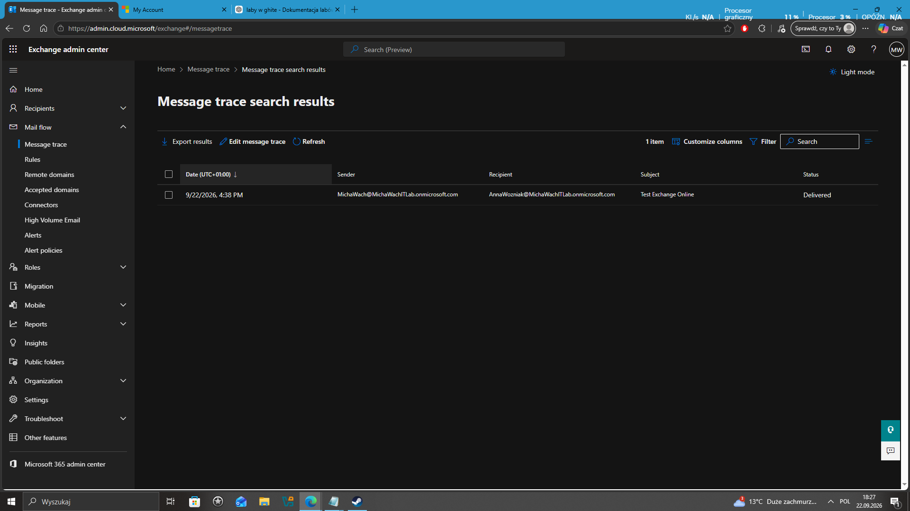
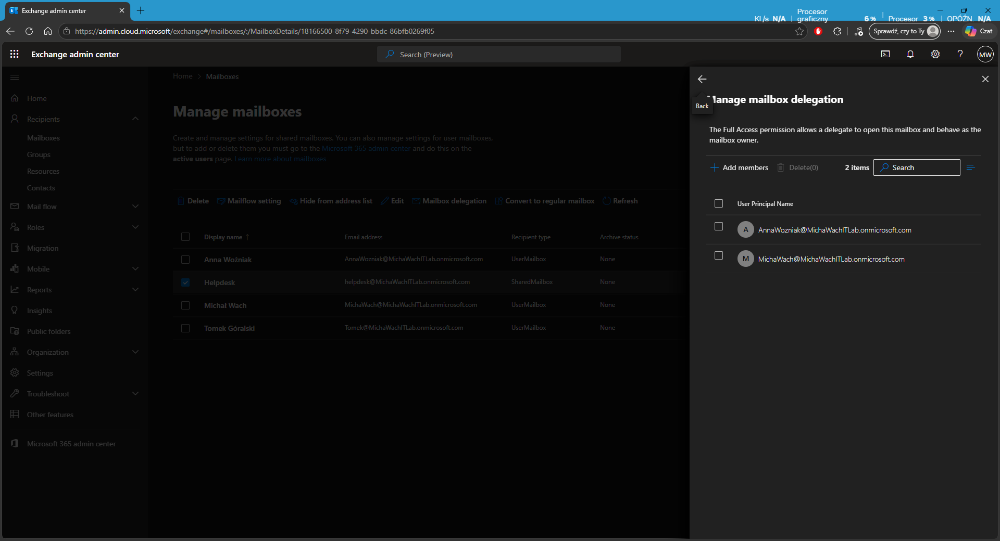
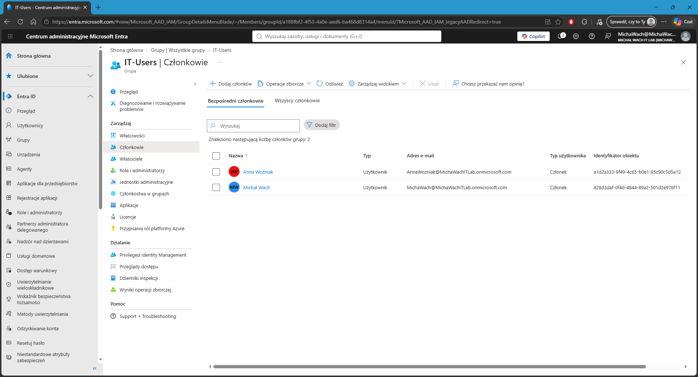
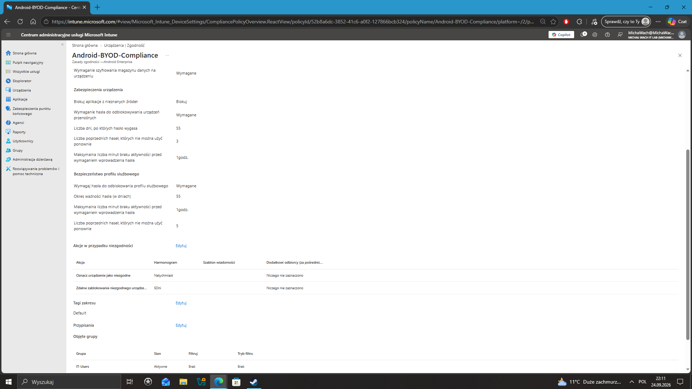

# Microsoft 365 Administration Lab

A practical Microsoft 365 home lab focused on common **IT Support / Helpdesk / Junior Administrator** tasks in a cloud environment.

The lab is built in a Microsoft 365 Business Premium test tenant and currently covers user administration, Exchange Online, Microsoft Entra ID and Microsoft Intune. The project is being expanded step by step with device enrollment, MFA and access-control scenarios.

---

## Lab overview

| Area | What I practiced |
|---|---|
| Microsoft 365 Admin Center | Users, licenses and account administration |
| Exchange Online | User mailboxes, mail flow troubleshooting, shared mailboxes and delegation |
| Microsoft Entra ID | Users and security groups |
| Microsoft Intune | Android Enterprise BYOD compliance policy |
| Planned next steps | Android device enrollment, work profile, MFA, Conditional Access, Teams / SharePoint basics |

---

## Microsoft 365 user administration

I created test user accounts in the Microsoft 365 tenant and assigned Microsoft 365 Business Premium licenses.

The lab included common helpdesk tasks such as:

- creating users,
- assigning licenses,
- resetting user passwords,
- requiring a password change at sign-in,
- signing in as test users to validate access,
- verifying that Exchange Online mailboxes were provisioned.

This provided practice with the basic user lifecycle that is common in IT support environments.

---

## Exchange Online

### Mailbox and mail-flow testing

Test users were used to send and receive email through Outlook / Exchange Online.

To verify mail delivery from the administrator side, I used **Message Trace** in the Exchange Admin Center.

The test message was successfully tracked with the status:

```text
Delivered
```



This is useful in a helpdesk scenario where a user reports that an email was not received. Message Trace helps determine whether Exchange Online accepted and delivered the message before troubleshooting the Outlook client, mailbox rules or junk mail.

### Shared mailbox

I created a shared mailbox for a helpdesk-style address:

```text
Helpdesk
```

Users were granted mailbox delegation permissions, including **Full Access** and **Send As**.

This allows authorized users to work with a common mailbox without sharing a single account password.



This scenario helped me understand the difference between:

- **Full Access** — open and manage the shared mailbox,
- **Send As** — send email that appears to come directly from the shared mailbox,
- **Send on behalf** — send email on behalf of the mailbox owner.

---

## Microsoft Entra ID

I created an assigned **Security group** named:

```text
IT-Users
```

Test users were added as members of the group.



The group was then used as the assignment target for an Intune policy.

This demonstrates a common administration model:

```text
Users
  ↓
Security Group
  ↓
Policy assignment
```

---

## Microsoft Intune

### Android BYOD compliance policy

I created an Android Enterprise compliance policy for a **user-owned device with a work profile**.

Policy name:

```text
Android-BYOD-Compliance
```

The policy includes requirements such as:

- device storage encryption,
- blocking applications from unknown sources,
- requiring a device password / screen lock,
- requiring protection for the work profile,
- marking non-compliant devices as non-compliant.

The policy was assigned to the Entra ID security group:

```text
IT-Users
```



This gave me practical experience with the relationship between Entra ID groups and Intune policy assignments.

---

## Troubleshooting and support scenarios practiced

The lab has already included several realistic support scenarios:

- a user account without a Microsoft 365 license could not open Outlook because no Exchange mailbox was available,
- verifying successful mail delivery with Exchange Online Message Trace,
- configuring shared mailbox permissions instead of sharing credentials,
- assigning cloud policies to users through an Entra ID security group,
- creating a compliance policy for Android BYOD devices.

---

## Planned next steps

The lab is still being developed. Planned improvements include:

### Android device enrollment

Enroll a real Android phone in Microsoft Intune and create an Android Enterprise work profile.

Planned workflow:

```text
Android phone
      ↓
Microsoft Intune enrollment
      ↓
Android Enterprise Work Profile
      ↓
IT-Users group assignment
      ↓
Android-BYOD-Compliance
      ↓
Compliant / Noncompliant status
```

The goal is to validate the compliance policy on a real device rather than only creating it in the admin portal.

### MFA

Configure and test multi-factor authentication for test users and document the sign-in experience.

### Conditional Access

Create a basic Conditional Access scenario that can use device compliance as an access requirement.

The goal is to understand the relationship between:

```text
Entra ID identity
      +
Intune device compliance
      ↓
Conditional Access
      ↓
Access decision
```

### Teams and SharePoint

Practice basic administration of Microsoft Teams and SharePoint, including users, groups and access to shared resources.

---

## Skills practiced

- Microsoft 365 Admin Center
- user and license administration
- password reset and account support
- Exchange Online administration
- Exchange Message Trace
- shared mailboxes
- mailbox delegation
- Microsoft Entra ID
- security groups
- Microsoft Intune
- Android Enterprise BYOD concepts
- compliance policies
- policy assignment through groups
- cloud troubleshooting

---

## Project status

**In progress.**

Current focus: expanding the lab from Microsoft 365 and Exchange administration into **Microsoft Intune device management, Android enrollment, MFA and Conditional Access**.
