# Microsoft 365 Administration Lab

Hands-on Microsoft 365 administration lab focused on practical Helpdesk / Junior Administrator tasks.

Environment: **Microsoft 365 Business Premium trial tenant**

## Lab scope

The lab covers:

- Microsoft 365 user and license administration
- Exchange Online mailboxes and message tracing
- Microsoft Entra ID users, groups and MFA
- Microsoft Intune Android Enterprise BYOD management
- Android Work Profile enrollment
- application deployment with Intune
- device compliance
- Conditional Access testing and troubleshooting
- Microsoft Teams and SharePoint integration

## Microsoft 365 Admin Center

I created test user accounts and performed basic user administration tasks:

- created users
- assigned Microsoft 365 Business Premium licenses
- reset passwords
- required password change at next sign-in
- verified access to licensed Microsoft 365 services

## Exchange Online

I created and tested Exchange Online mailboxes.

A test message was sent between users and verified with **Message Trace** in the Exchange Admin Center.

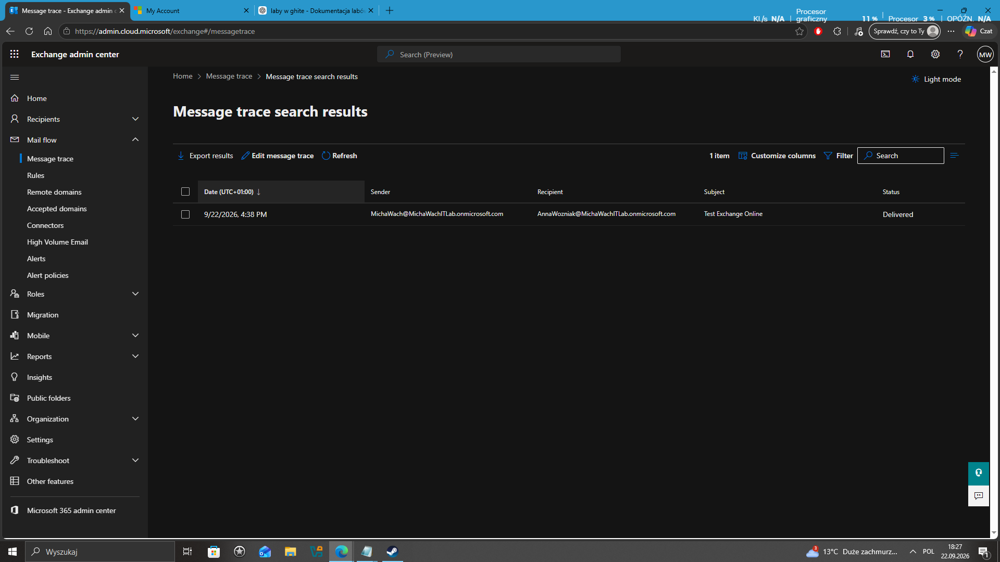

I also created a shared mailbox named:

```text
Helpdesk
```

and configured delegation permissions:

- **Full Access** - open and manage the mailbox
- **Send As** - send messages as the Helpdesk mailbox

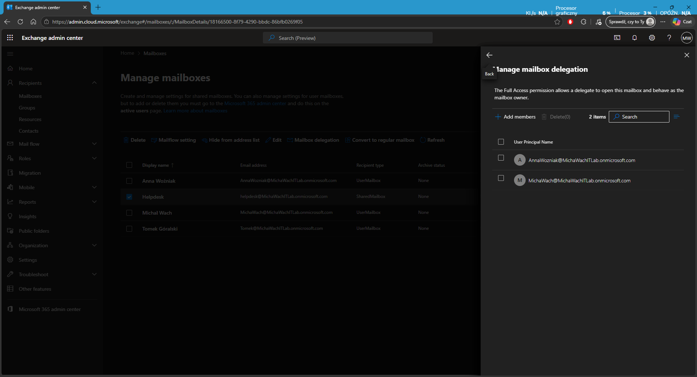

## Microsoft Entra ID

I created the security group:

```text
IT-Users
```

and added test users to it.

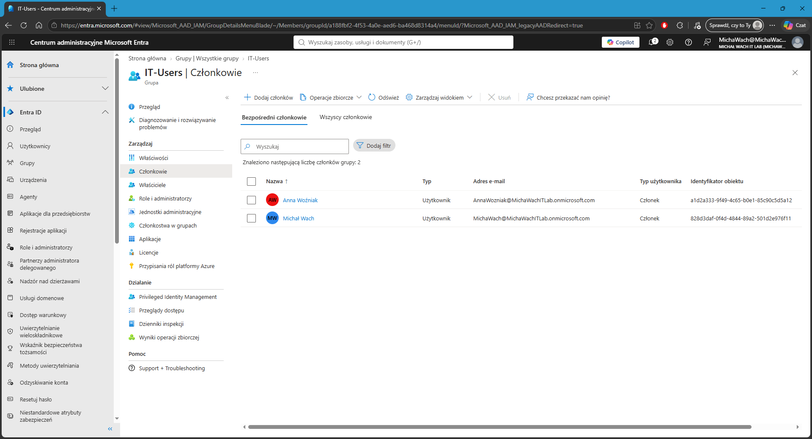

The group was later used as an assignment target for Intune policies and applications.

### MFA

Microsoft Authenticator was registered as an authentication method for the test user.

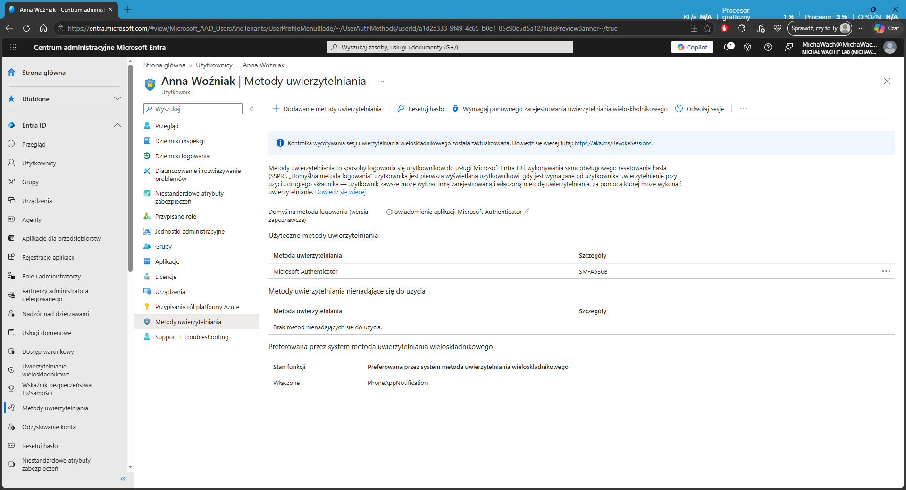

I also verified MFA information in Entra sign-in logs.

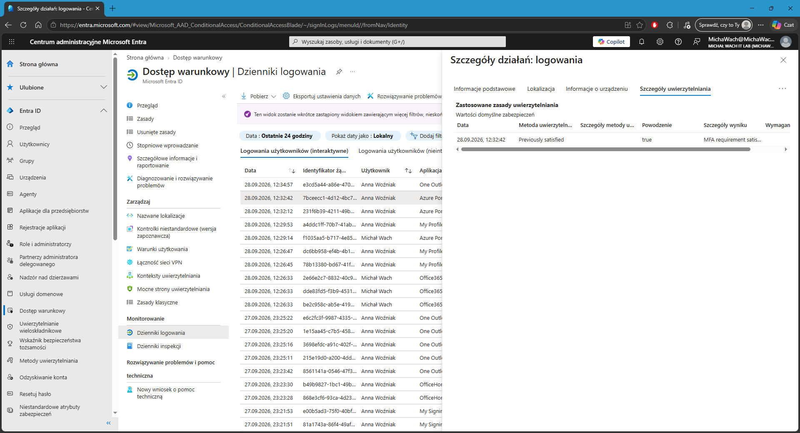

## Microsoft Intune / Android Enterprise BYOD

Managed Google Play was connected to Intune and a real Android phone was enrolled using an **Android Enterprise Work Profile**.

I created the compliance policy:

```text
Android-BYOD-Compliance
```

and assigned it to the `IT-Users` group.

Configured requirements included:

- device storage encryption
- blocking applications from unknown sources
- device password / screen lock
- work profile password protection

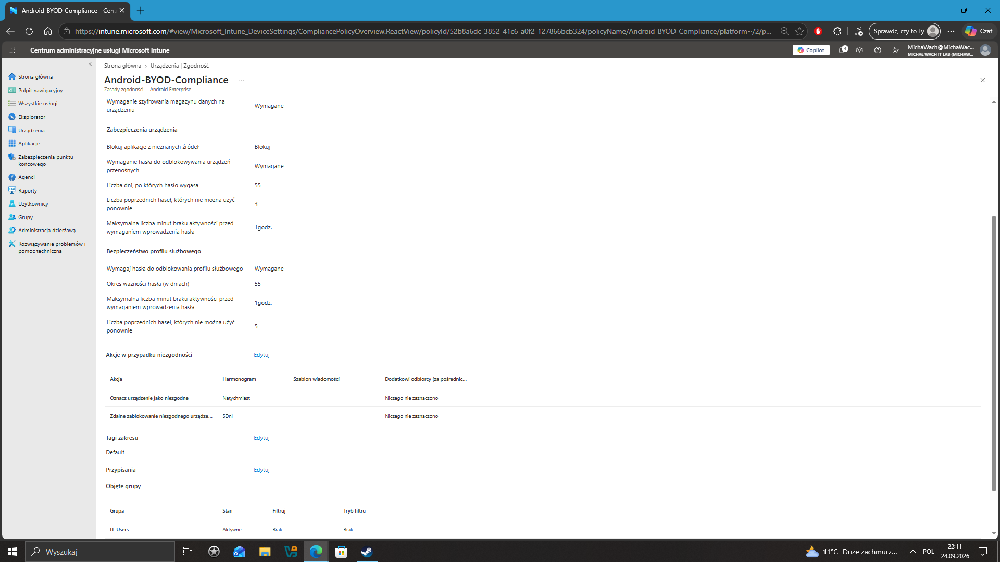

After enrollment, Intune reported the Android device as compliant.

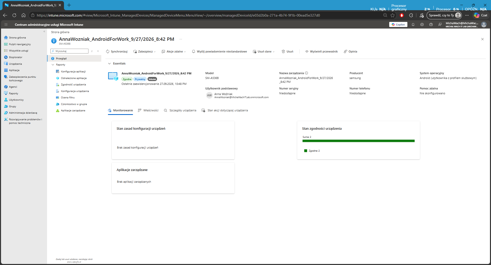

The same device was also visible in Microsoft Entra ID as:

```text
Managed:   Yes
Compliant: Yes
Join type: Azure AD registered
```

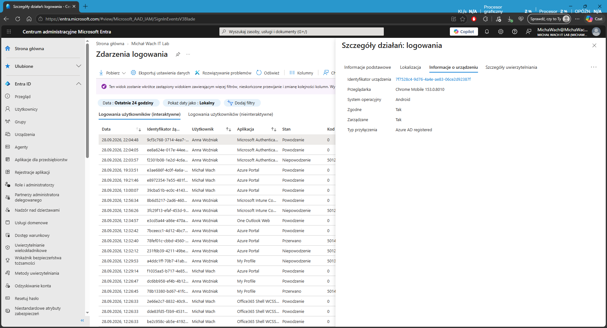

### Outlook deployment

Microsoft Outlook was assigned to the `IT-Users` group as a **Required** Android Enterprise application.

The application was automatically installed inside the Android Work Profile and the test user was able to access the Exchange Online mailbox from the managed Outlook application.

## Conditional Access

I created a Conditional Access policy:

```text
CA-Require-MFA-And-Compliant-Device
```

The policy targeted the test user and Microsoft 365 resources and required:

- multifactor authentication
- a device marked as compliant

The policy was kept in **Report-only** mode during testing. Security Defaults remained enabled, so the lab focused on evaluating Conditional Access results without enforcing the policy.

### Conditional Access troubleshooting

The combined policy initially returned:

```text
Report-only: Failure
```

even though the Android device was shown as both managed and compliant.

To isolate the cause, I separated the grant controls into test policies:

```text
CA-Test-MFA
CA-Test-Compliant-Device
```

The results showed:

```text
CA-Test-MFA
→ Report-only: User action required

CA-Test-Compliant-Device
→ Report-only: Success
```

This confirmed that device compliance was working correctly and that the combined policy failed because MFA was not satisfied for that specific token/request in Report-only evaluation.

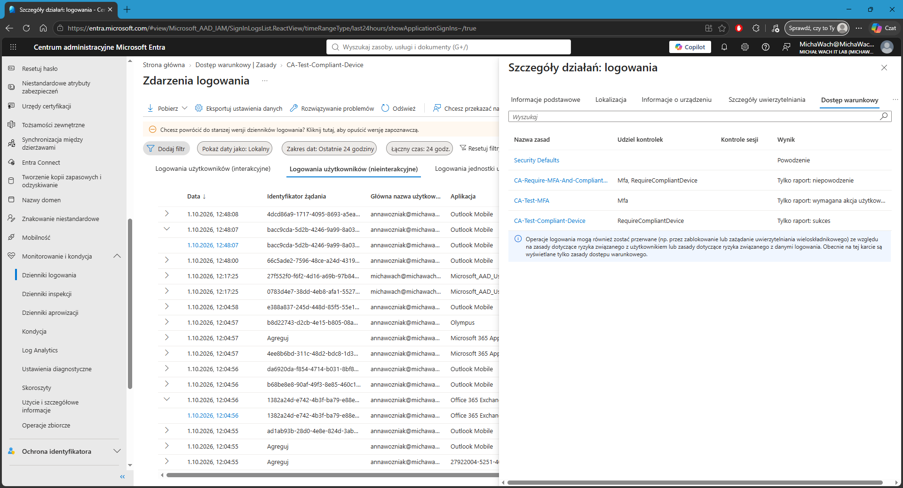

During this troubleshooting, the compliance-only policy initially returned **Not applied**. Sign-in details showed:

```text
Device platform: Android
Result: Not matched
Reason: Excluded platform
```

I corrected the device-platform scope so Android was included. A new Outlook Mobile / Exchange Online sign-in then returned **Report-only: Success** for the compliance-only policy.

### Revoked session / token troubleshooting

While testing authentication I revoked the user's sign-in sessions.

Outlook Mobile then generated sign-in failures with error:

```text
AADSTS50173
The provided grant has expired due to it being revoked.
A fresh auth token is needed.
```

The existing refresh token had been invalidated by the session revocation. I removed and re-added the account in the managed Outlook application, completed a fresh sign-in and verified successful Exchange Online activity again.

This was useful for understanding the difference between:

- an application problem
- a device compliance problem
- a Conditional Access result
- an expired or revoked authentication token

## Microsoft Teams and SharePoint

I created a Microsoft Teams team:

```text
IT Team Support
```

with a standard channel:

```text
helpdesk
```

The team contained:

- Michał Wach - Owner
- Anna Woźniak - Member

A test file named `Helpdesk-Instructions.txt` was added to the Helpdesk channel.

I then opened the channel files in SharePoint and verified that the same file was stored in the team's SharePoint document library.

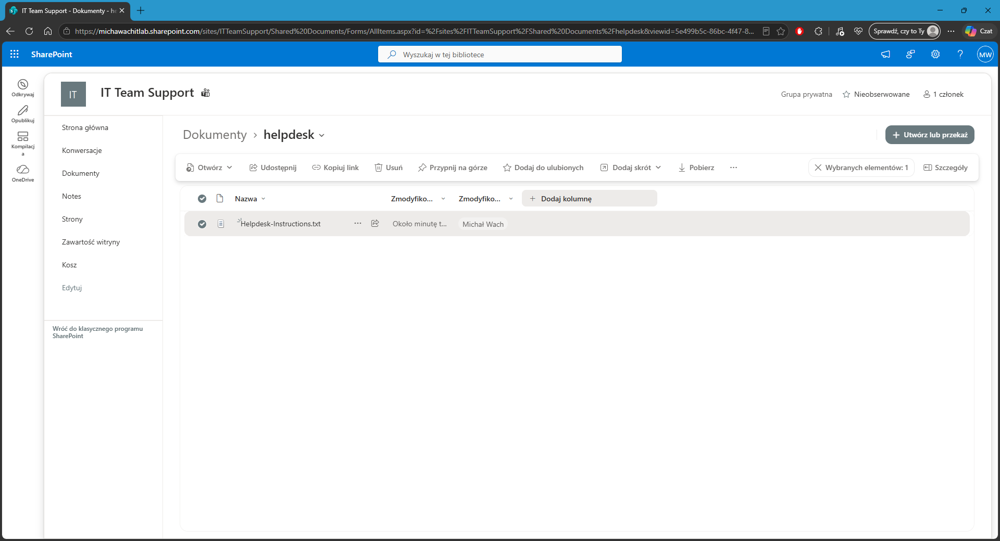

I also verified the group membership and roles associated with the SharePoint team site.

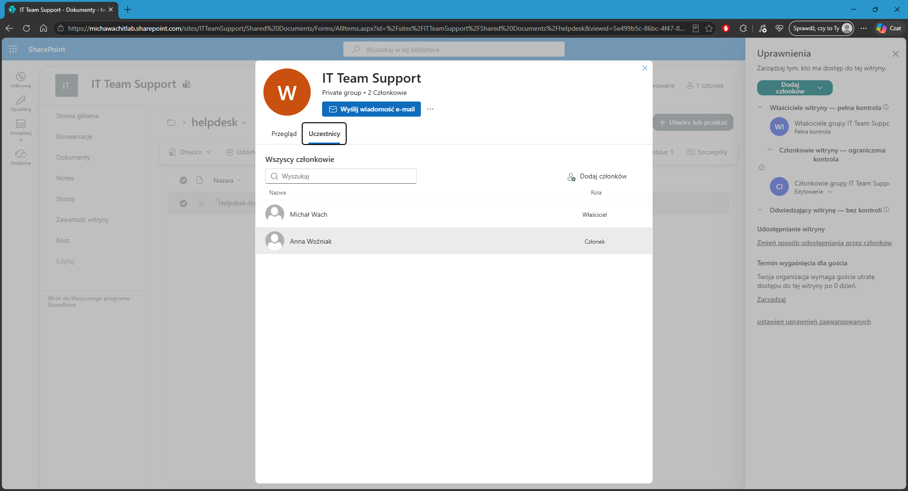

This demonstrated the relationship:

```text
Microsoft 365 / Entra identity
        ↓
Microsoft 365 group
        ↓
Microsoft Teams
        ↓
Standard channel
        ↓
SharePoint document library
```

## Troubleshooting summary

### Outlook account had no mailbox

I initially tried to open Outlook with an administrator account that did not have a Microsoft 365 license.

Exchange Online had therefore not provisioned a mailbox for that account. I verified the licensing difference and continued testing with a licensed user.

### Verifying mail delivery

Instead of relying only on the recipient inbox, I used **Exchange Message Trace** to confirm that a test message was delivered successfully.

This is useful for tickets such as:

```text
"The email was sent, but the recipient says it did not arrive."
```

### Shared mailbox permissions

The Helpdesk mailbox used delegated permissions instead of sharing a single account:

```text
Full Access = open and manage the mailbox
Send As     = send mail as Helpdesk
```

### Conditional Access failure isolation

A combined `MFA + compliant device` policy returned a Report-only failure.

I used sign-in logs and separate test policies to isolate the controls:

```text
Compliance → Success
MFA        → User action required
```

### Android excluded from compliance test

The compliance-only Conditional Access policy initially returned `Not applied`.

Policy details showed that Android was excluded from the device-platform scope. After correcting the scope, the same type of Outlook Mobile / Exchange Online sign-in returned `Report-only: Success`.

### AADSTS50173 after session revocation

After revoking the user's sessions, Outlook Mobile continued using an invalidated token and generated `AADSTS50173`.

A fresh authentication was required. Re-adding the account generated a new token and restored successful Exchange Online access.

## Skills practiced

- Microsoft 365 Admin Center
- user and license administration
- password reset and account support
- Exchange Online
- Message Trace
- shared mailboxes and delegation
- Microsoft Entra ID
- security groups
- Microsoft Authenticator / MFA
- sign-in log analysis
- Microsoft Intune
- Managed Google Play
- Android Enterprise Work Profile
- BYOD device enrollment
- compliance policies
- managed application deployment
- Conditional Access
- Report-only testing
- authentication and token troubleshooting
- Microsoft Teams administration
- SharePoint team sites and permissions

## Status

**Lab completed.**

The environment demonstrates a small Microsoft 365 workflow from identity and licensing through Exchange, mobile device management, compliance, Conditional Access testing and Teams / SharePoint collaboration.
